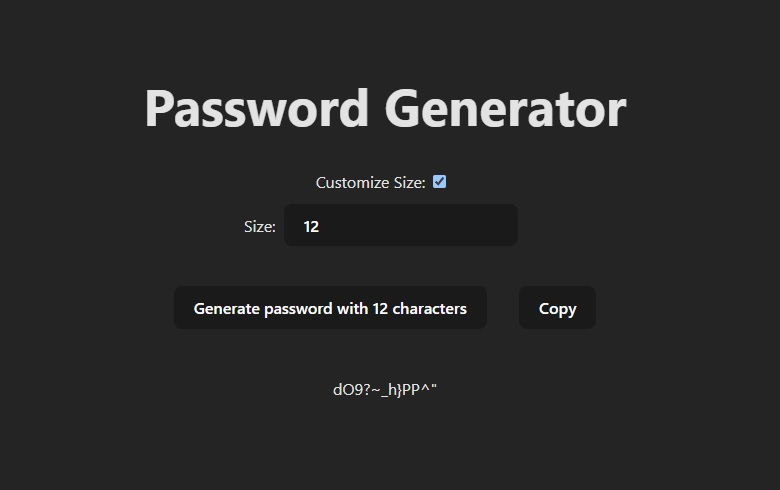

Password Generator using ReactJS.

This is a simple password generator, made with a single React component.
It generates a password with numbers, uppercase and lowercase letters and symbols, always.
You can customize the password size or use the standard 8 character size and copy the output.

